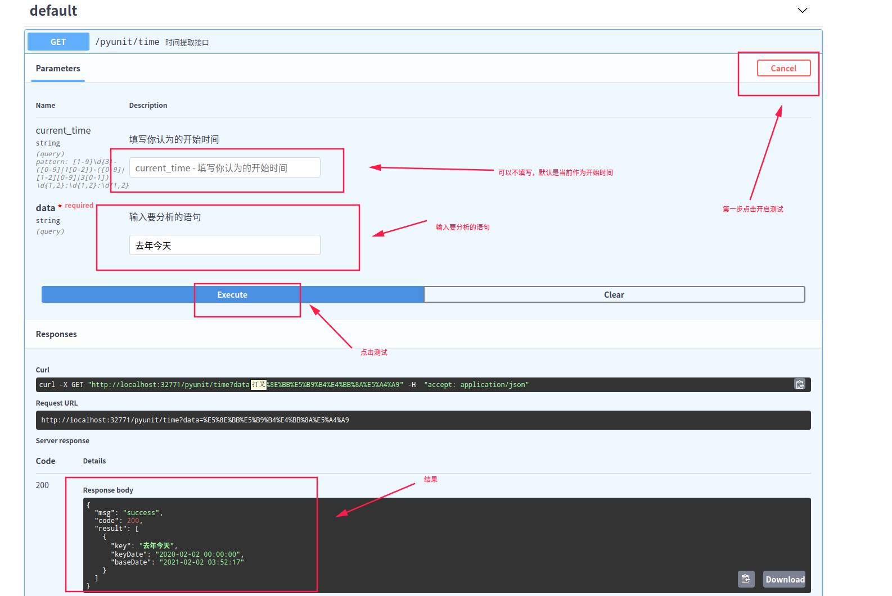

# **pyUnit_time** [][1]

## 处理时间模块集合

[](https://pypi.org/project/pyunit-time/)
[]()

### 安装

    pip install pyunit-time

## 测试

```python
from pyunit_time import Time


def time():
    """字符字符串时间解析"""
    print(Time('2020-4-22 00:00:00').parse('这个月的第三个星期天'))
    # [{'key': '这个月第3个星期天', 'keyDate': '2020-04-19 00:00:00', 'baseDate': '2020-04-22 00:00:00'}]

    print(Time('2020-4-22 00:00:00').parse('前2年的国庆节的后一天晚上8点半'))
    # [{'key': '前2年国庆节后1天晚上8点半', 'keyDate': '2018-09-30 20:30:00', 'baseDate': '2020-04-22 00:00:00'}]

    print(Time('2020-4-22 00:00:00').parse('上上个月'))
    # [{'key': '上上个月', 'keyDate': '2020-02-22 00:00:00', 'baseDate': '2020-04-22 00:00:00'}]

    print(Time('2020-4-22 00:00:00').parse('今天晚上8点'))
    # [{'key': '今天晚上8点', 'keyDate': '2020-04-22 20:00:00', 'baseDate': '2020-04-22 00:00:00'}]

    print(Time('2020-4-22 00:00:00').parse('今年儿童节晚上九点一刻'))
    # [{'key': '今年儿童节晚上9点1刻', 'keyDate': '2020-06-01 21:15:00', 'baseDate': '2020-04-22 00:00:00'}]

    print(Time('2020-4-22 00:00:00').parse('今天中午十二点'))
    # [{'key': '今天中午12点', 'keyDate': '2020-04-22 12:00:00', 'baseDate': '2020-04-22 00:00:00'}]

    print(Time('2020-4-22 00:00:00').parse('明年春节'))
    # [{'key': '明年春节', 'keyDate': '2021-02-12 00:00:00', 'baseDate': '2020-04-22 00:00:00'}]

    print(Time('2020-4-22 00:00:00').parse('明年的感恩节'))
    # [{'key': '明年感恩节', 'keyDate': '2021-11-25 00:00:00', 'baseDate': '2020-04-22 00:00:00'}]

    print(Time('2020-4-22 00:00:00').parse('下3个星期1早上7点半'))
    # [{'key': '下3个星期1早上7点半', 'keyDate': '2020-05-11 07:30:00', 'baseDate': '2020-04-22 00:00:00'}]

    print(Time('2020-4-22 00:00:00').parse('今年的大寒'))
    # [{'key': '今年大寒', 'keyDate': '2021-01-20 00:00:00', 'baseDate': '2020-04-22 00:00:00'}]

    print(Time('2020-4-22 00:00:00').parse('2019年12月'))
    # [{'key': '2019年12月', 'keyDate': '2019-12-01 00:00:00', 'baseDate': '2020-04-22 00:00:00'}]

    print(Time('2020-4-22 00:00:00').parse('8年前'))
    # [{'key': '8年前', 'keyDate': '2012-04-22 00:00:00', 'baseDate': '2020-04-22 00:00:00'}]

    print(Time('2020-4-22 00:00:00').parse('三天以后'))
    # [{'key': '3天以后', 'keyDate': '2020-04-25 00:00:00', 'baseDate': '2020-04-22 00:00:00'}]

    print(Time('2020-4-22 00:00:00').parse('三天之内的下午3点'))
    # [{'key': '3天之内下午3点', 'keyDate': '2020-04-25 15:00:00', 'baseDate': '2020-04-22 00:00:00'}]

    print(Time('2020-4-22 00:00:00').parse('后三天的下午4点56秒'))
    # [{'key': '后3天下午4点56秒', 'keyDate': '2020-04-25 16:00:56', 'baseDate': '2020-04-22 00:00:00'}]


if __name__ == '__main__':
    time()
```

## Docker部署

    docker pull jtyoui/pyunit-time
    docker run -d -p 32771:80 pyunit-time

## Swagger在线api文档

    http://localhost:32771/docs



## 请求报文

|**参数名**|**类型**|**是否可以为空**|**说明**|
|------|------|-------|--------|
|current_time|string|YES|输入当前时间，这里的时间是相对于分析时间而言。默认是当前时刻|
|data|string|NOT|分析一句话中的时间关键词|     

## 返回报文

|**参数名**|**类型**|**是否可以为空**|**说明**|
|------|------|-------|--------|
|msg|string|NOT|错误信息|
|code|INT|NOT|状态码，正确为200，错误为0|     
|result|string|NOT|结果信息，列表|     
|baseDate|string|NOT|开始时间|     
|key|string|NOT|时间关键字|     
|keyDate|string|NOT|关键字分析出来的时间|     

***

[1]: https://blog.jtyoui.com